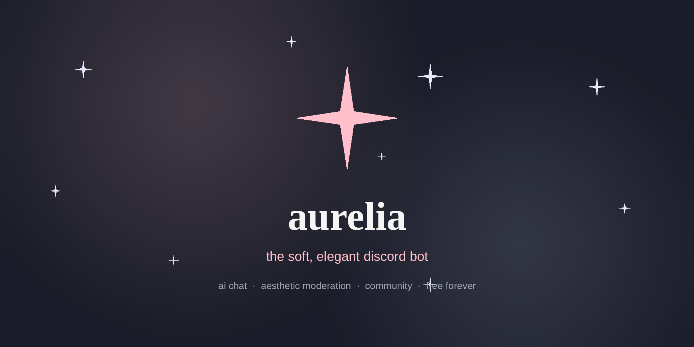
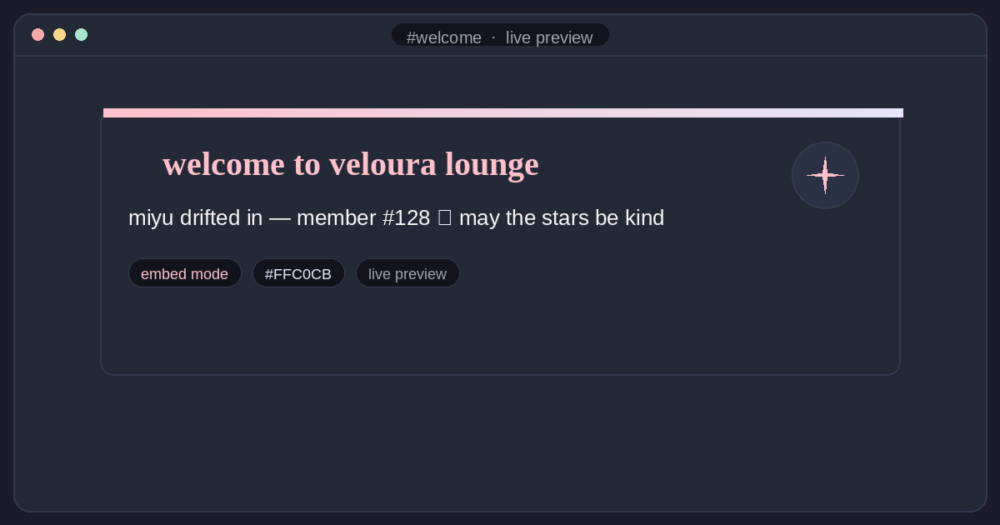
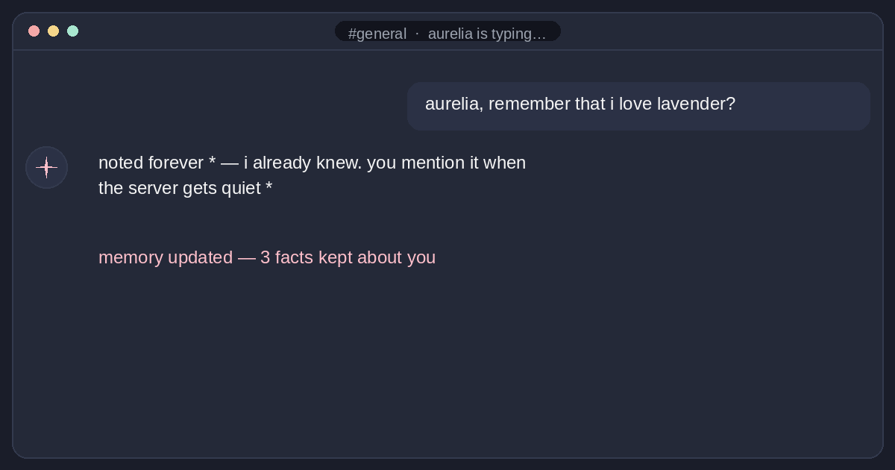
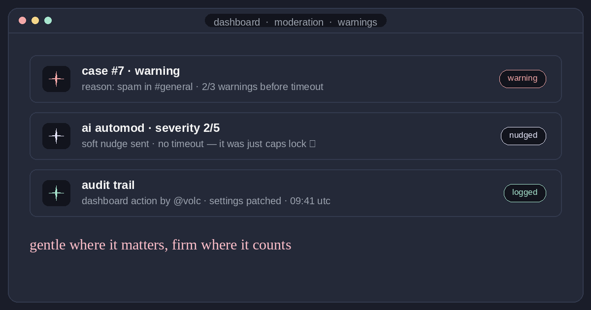

<p align="center">
  
</p>

<h1 align="center">aurelia ✦</h1>

<p align="center"><b>the soft, elegant discord bot</b><br/>
aesthetic moderation, ai chat, and community features for your veloura-vibe server</p>

<p align="center">
  <a href="https://veloura-aurelia.vercel.app"></a>
  
  
  
  
  
</p>

<p align="center">
  <a href="https://veloura-aurelia.vercel.app"><b>add to discord ✦</b></a> ·
  <a href="https://veloura-aurelia.vercel.app/docs">documentation</a> ·
  <a href="https://veloura-aurelia.vercel.app/stats">live stats</a> ·
  <a href="https://veloura-aurelia.vercel.app/changelog">changelog</a>
</p>

<p align="center">
  
</p>

---

## why aurelia ♡

she's the bot for communities that care about vibes. every feature is
built twice — once as a slash command, once as something soft to look
at. talk to her, let her greet your newcomers, and let moderation be
firm where it matters and gentle everywhere else.

| | |
|---|---|
| **ai chat & memory** | `@aurelia hey what's up` — she keeps the conversation thread and learns durable facts. per-server personality, opt-out per user. |
| **aesthetic welcome cards** | embed / text / hybrid / dm modes, custom colors, live preview in the dashboard. |
| **smart moderation** | warnings as numbered cases, escalating thresholds, context-aware ai automod (severity 1-5), full audit log. |
| **engagement** | leveling + role rewards, daily streaks, qotd, giveaways with realtime entries, starboard, confessions, ships, achievements. |
| **a real dashboard** | 34 module pages with live discord pickers, one-click live actions and realtime updates. |
| **privacy first** | `/privacy export` (full json) and `/privacy delete` (erase everywhere) built in. |

<p>
  
  
  
</p>

## quick start (using her)

1. **invite** — [add to discord ✦](https://veloura-aurelia.vercel.app)
   (curated permissions, never administrator)
2. **run** `/setup` — the interactive wizard configures welcome,
   leveling, qotd and friends in under two minutes
3. **talk** — `/help` for the menu, or just `@aurelia hello`

new servers also get a friendly owner dm with quick-start links, and
everything is configurable visually in the
[dashboard](https://veloura-aurelia.vercel.app).

## self-hosting (building with her)

prerequisites: python 3.11+, a discord bot token
([developer portal](https://discord.com/developers/applications)), a
free groq api key ([console.groq.com](https://console.groq.com)), and
optionally a free supabase project for persistent data.

```bash
git clone https://github.com/hamzaa1i/miles-discord-bot.git
cd miles-discord-bot
pip install -r requirements.txt
cp .env.example .env          # then edit: DISCORD_TOKEN, GROQ_API_KEY, OWNER_ID
python main.py
```

the dashboard is optional but lovely — deploy
[`dashboard/`](./dashboard) to vercel (free) following
[`dashboard/README.md`](./dashboard/README.md). render + uptime robot
notes are in [hosting](#hosting-render--uptimerobot) below. full docs:
[documentation](https://veloura-aurelia.vercel.app/docs) ·
[command reference](./COMMANDS.md) ·
[api](https://veloura-aurelia.vercel.app/docs/api)

## tech stack

- **bot** — python 3.11 · discord.py 2.7 · groq (open models, fast
  inference) · 46 cogs, 168 commands
- **data** — supabase postgres with a json-file fallback so every
  feature works even before the (free) db is wired up
- **dashboard** — next.js 14 · react 18 · tailwind · supabase realtime
- **api** — flask blueprint on the bot process: bearer-auth,
  manage-guild-gated, csrf-protected, rate-limited, audit-logged
- **infra** — render (bot) + vercel (dashboard), both free tier

## hosting (render + uptimerobot)

1. render → new web service → this repo → python 3.11.9
2. build `pip install -r requirements.txt` · start `python main.py`
3. env vars: `DISCORD_TOKEN`, `GROQ_API_KEY`, `OWNER_ID`,
   `PYTHON_VERSION=3.11.9`, (optional) `SUPABASE_URL`, `SUPABASE_KEY`,
   `SUPPORT_SERVER_URL`
4. uptimerobot → https monitor on `https://<your-app>.onrender.com/health`
   every 5 minutes (keeps the free tier awake)
5. run the sql migration blocks at the top of
   [`utils/db.py`](./utils/db.py) in the supabase sql editor when
   you're ready for persistent storage

> the `/data` folder is ephemeral on render's free tier — the json
> fallback resets on redeploy, which is exactly why supabase is the
> recommended (free) persistence layer.

### slash-command cache quirks

when commands change, discord's client may show stale ones for up to an
hour — fully quit and reopen discord to force a refresh.

## contributing ♡

issues and pull requests are genuinely welcome — the repo runs on
"small, soft, well-tested changes":

1. fork → branch (`feat/my-idea`)
2. keep the voice (lowercase, gentle) and the architecture notes in
   [`AUDIT.md`](./AUDIT.md) / [`dashboard/ARCHITECTURE.md`](./dashboard/ARCHITECTURE.md) in mind
3. add your feature to `COMMANDS.md` + the tests in `scripts/`
4. open the pr — describe the *why* first

## license

MIT — see [LICENSE](./LICENSE). free forever, no premium tiers, no ads.
built by **volc**, wrapped in veloura ✧
